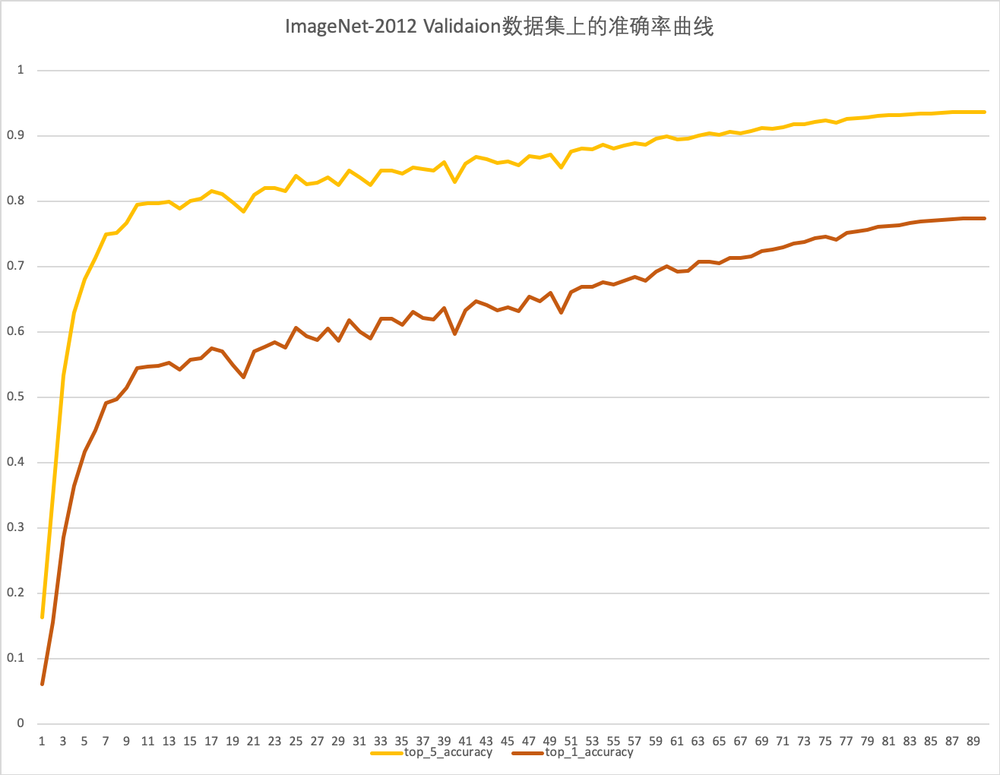
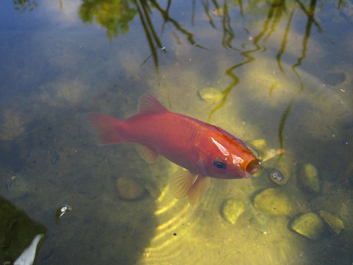

## Introduction

### Image classification and CNN

 **Image classification** refers to the image processing method that distinguishes the different types of targets from the different features reflected in the image information. It is the basis of other tasks in computer vision, such as target detection, semantic segmentation, and face recognition.

ImageNet Large-scale Visual Recognition Challenge (ILSVRC), often called ImageNet competition, includes tasks such as image classification, object positioning, and object detection. It is one of the most important competitions to promote the development of computer vision

In the 2012 ImageNet competition, the deep convolutional network AlexNet came out.With a top-5 accuracy rate exceeding the second place by more than 10%, he won the championship of ImageNet2012 competition.Since then, the deep learning method represented by **CNN (Convolutional Neural Network)** has begun to shine in the field of computer vision, and more and deeper CNN networks have been proposed, such as the champion of the ImageNet2014 competition ResNet, the champion of VGGNet, ImageNet2015 competition.


### ResNet

[ResNet](https://arxiv.org/abs/1512.03385) is the winner of the 2015 ImageNet competition.At present, ResNet is very good compared with traditional machine learning classification algorithms. After it came out, a large number of tasks such as detection, segmentation, and recognition are also completed on the basis of ResNet.

In this introduction, we provide the implementation of ResNet50 v1.5 in OneFlow.After 90 rounds of training on the ImageNet-2012 dataset, the accuracy on the validation set can reach: 77.318% (top1), 93.622% (top5).

For more detailed network parameter alignment, see [cnns of OneFlow-Benchmark](https://github.com/Oneflow-Inc/OneFlow-Benchmark/Classification/cnns)




**Notes on ResNet50 v1.5:**

> ResNet50 v1.5 is an improved version of the original [ResNet50 v1](https://arxiv.org/abs/1512.03385). Compared with the original model, the accuracy is slightly improved (~0.5% top1). For details, please refer to [here](https://github.com/NVIDIA/DeepLearningExamples/tree/master/MxNet/Classification/RN50v1.5).


Are you ready to get your hands dirty and reproduce the above results?


Below, this article takes the ResNet50 above as an example to show how to use OneFlow to train and predict the ResNet50 network step by step.

It mainly includes

- Preparation
  - Project installation and preparation

- Quick Start
  - Prediction/Inference
  - Training and Validation
  - Evaluation
- Detailed Introduction
  - Distributed Training
  - Mixed precision training and prediction
- Advanced
  - Parameter alignment
  - Dataset production (ImageNet2012)
  - Convert OneFlow model to ONNX model


## Requirements

Don't worry, It is very easy to use OneFlow. Just prepare the following three steps to start OneFlow's image recognition journey.

- When installing OneFlow, please refer to [OneFlow project homepage](https://github.com/Oneflow-Inc/oneflow)

- 克隆/下载[OneFlow-Benchmark](https://github.com/Oneflow-Inc/OneFlow-Benchmark)仓库。

  `git clone git@github.com:Oneflow-Inc/OneFlow-Benchmark.git`

  `cd  OneFlow-Benchmark/Classification/cnns`

- Prepare data set (optional)

  - Use synthetic virtual synthetic datasets directly
  - Download the Imagenet (2012) [mini data set](https://oneflow-public.oss-cn-beijing.aliyuncs.com/online_document/dataset/imagenet/mini-imagenet.zip) we made and unzip it into the data directory
  - Or: Make a complete ImageNet dataset in Ofrecord format (see the advanced section below)

We provide the general scripts: train.sh and inference.sh, which are suitable for training, verification, and inference of all cnn network models under this repository.You can use different models and datasets for training/inference by setting parameters.

 **Notes on the model:**

> By default, we use resnet50. You can also specify other models by changing the --model parameter in the script, such as: --model="resnet50", --model="vgg", etc.

**Notes on the dataset:**


> 1) In order to let readers get started quickly, we provide synthetic virtual synthetic data. "Synthetic data" refers to not loading data through disk, but directly generating some random data in memory as the data input source of neural network.
> 
> 2) At the same time, we provide a small mini sample dataset.Download and unzip it directly to the root directory of the cnn project to quickly start training.After being familiar with the process, readers can refer to the data set production part to make a complete Imagenet2012 data set.
> 
> 3) Using Ofrcord format data set can improve data loading efficiency (but it is not necessary, refer to [Data input](https://github.com/Oneflow-Inc/oneflow-documentation/docs/basics_topics/data_input.md), oneflow supports direct loading numpy data).


## Quick Start

So next, let's start OneFlow's image recognition journey!

First, switch to the directory:

```
cd OneFlow-Benchmark/Classification/cnns
```

### Pre-trained model

#### resnet50

[resnet50_v1.5_model](https://oneflow-public.oss-cn-beijing.aliyuncs.com/model_zoo/resnet_v15_of_best_model_val_top1_77318.tgz) (validation accuracy: 77.318% top1，93.622% top5 )

### Prediction/inference

Download our trained model: [resnet50_v1.5_model](https://oneflow-public.oss-cn-beijing.aliyuncs.com/model_zoo/resnet_v15_of_best_model_val_top1_77318.tgz), unzip it and put it in the current directory, and then execute:

```shell
sh inference.sh
```

This script will call the model to classify this goldfish picture:




If the following content is output, the prediction is successful:

```
data/fish.jpg
0.87059885 goldfish, Carassius auratus
```

The model classify the image to be a goldfish with confidence of 87.05%.

### Train and Validation

- Training is also very simple, just execute:

  ```shell
  sh train.sh
  ```

  You can start the training of the model, and you will see the following output:

  ```shell
  Loading synthetic data.
  Loading synthetic data.
  Saving model to ./output/snapshots/model_save-20200723124215/snapshot_initial_model.
  Init model on demand.
  train: epoch 0, iter 10, loss: 7.197278, top_1: 0.000000, top_k: 0.000000, samples/s: 61.569
  train: epoch 0, iter 20, loss: 6.177684, top_1: 0.000000, top_k: 0.000000, samples/s: 122.555
  Saving model to ./output/snapshots/model_save-20200723124215/snapshot_epoch_0.
  train: epoch 0, iter 30, loss: 3.988656, top_1: 0.525000, top_k: 0.812500, samples/s: 120.337
  train: epoch 1, iter 10, loss: 1.185733, top_1: 1.000000, top_k: 1.000000, samples/s: 80.705
  train: epoch 1, iter 20, loss: 1.042017, top_1: 1.000000, top_k: 1.000000, samples/s: 118.478
  Saving model to ./output/snapshots/model_save-20200723124215/snapshot_epoch_1.
  ...
  ```

  > In order to facilitate running the demonstration, we use the synthetic virtual synthetic data set by default, so that you can quickly see the effect of the model running

  Similarly, you can also use the [mini sample data set](https://oneflow-public.oss-cn-beijing.aliyuncs.com/online_document/dataset/imagenet/mini-imagenet.zip), download and unzip it and put it into the root directory of the cnn project, and then modify the training script as follows:

  ```shell
  rm -rf core.* 
  rm -rf ./output/snapshots/*

  DATA_ROOT=data/imagenet/ofrecord

  python3 of_cnn_train_val.py \
      --train_data_dir=$DATA_ROOT/train \
      --num_examples=50 \
      --train_data_part_num=1 \
      --val_data_dir=$DATA_ROOT/validation \
      --num_val_examples=50 \
      --val_data_part_num=1 \
      --num_nodes=1 \
      --gpu_num_per_node=1 \
      --model_update="momentum" \
      --learning_rate=0.001 \
      --loss_print_every_n_iter=1 \
      --batch_size_per_device=16 \
      --val_batch_size_per_device=10 \
      --num_epoch=10 \
      --model="resnet50"
  ```

  Running this script will train a classification model on the mini imagenet dataset with only 50 goldfish images. Using it, you can classify goldfish images.

  Don't worry, if you need to train on the complete ImageNet2012 data set, please refer to: [OneFlow-Benchmark](https://github.com/Oneflow-Inc/OneFlow-Benchmark/cnns) repository.


### Evaluate

You can use the model you have trained yourself, or the [resnet50_v1.5_model](https://oneflow-public.oss-cn-beijing.aliyuncs.com/model_zoo/resnet_v15_of_best_model_val_top1_77318.tgz) provided by us (decompressed into the current directory) to evaluate the accuracy of the resnet50 model.

Just run:

```shell
sh evaluate.sh
```

You can get the accuracy of the trained model on the 50,000 validation set:

```shell
Time stamp: 2020-07-27-09:28:28
Restoring model from resnet_v15_of_best_model_val_top1_77318.
I0727 09:28:28.773988162    8411 ev_epoll_linux.c:82]        Use of signals is disabled. Epoll engine will not be used
Loading data from /dataset/ImageNet/ofrecord/validation
validation: epoch 0, iter 195, top_1: 0.773277, top_k: 0.936058, samples/s: 1578.325
validation: epoch 0, iter 195, top_1: 0.773237, top_k: 0.936078, samples/s: 1692.303
validation: epoch 0, iter 195, top_1: 0.773297, top_k: 0.936018, samples/s: 1686.896
```

> Before executing sh evaluate.sh, make sure to prepare the imagenet (2012) verification set. Please refer to the [OneFlow-Benchmark](https://github.com/Oneflow-Inc/OneFlow-Benchmark/cnns) repository for the verification set creation method.

From the evaluation results of the 3 rounds, our model has reached 77.32+% top_1 accuracy on Imagenet (2012).

Congratulations!You completed training/validation, inference and evaluation of the Resnet model on ImageNet, applaud for yourself!


## Details

### Distributed training

**Simple and easy-to-use distributed is one of OneFlow's main features.**

The OneFlow framework supports efficient distributed training naturally from the underlying designEspecially for distributed data parallelism, users don't have to worry about how to divide and synchronize data when the algorithm expands from a single machine with a single card to multiple machines with multiple cards.In other words, with OneFlow, users write algorithms for a single machine and a single card, and ** automatically has the capability of multi-machine and multi-card distributed data parallelism.**</strong>


#### How to configure and run distributed training?

Take the code demonstrated in the "Quick Start" section above as an example. In train.sh, just use --num_nodes to specify the number of nodes (machines), and use --node_ips to specify the ip address of the node, and then use --gpu_num_per_node to specify The number of cards used on each node can easily complete the distributed configuration.

For example, if you want to perform distributed training on 2 machines and 8 cards, configure as follows:

```shell
# train.sh 
python3 of_cnn_train_val.py \
    --num_nodes=2 \
    --node_ips="192.168.1.1, 192.168.1.2"
    --gpu_num_per_node=4 \
    ...
    --model="resnet50"
```

Then execute on two machines at the same time:

```shell
./train.sh
```

After the program is started, through the `watch -n 0.1 nvidia-smi` command, you can see that the GPUs of both machines have started to work.After a period of time, the output will be printed on the screen of the first machine in the `--node_ips` setting.


### Mixed precision training and prediction

Currently, OneFlow has supported half-precision/full-precision mixed precision training.During training, the model parameters (weights) are trained using float16, while float32 is reserved for the gradient update and calculation process.As the parameter storage is halved, the training will speed up.

Turn on the half-precision/full-precision mixed-precision training mode in OneFlow, and the training speed of ResNet50 can theoretically reach `1.7` times acceleration.


#### How to turn on half-precision/full-precision mixed precision training?

Just add the parameter --use_fp16=True in the train.sh script.

#### Mixed precision model

We provide you with a mixed-precision model that has been fully trained on Imagenet2012 for 90 epochs, top_1: 77.33%

You can directly download and use: [resnet50_v15_fp16](https://oneflow-public.oss-cn-beijing.aliyuncs.com/model_zoo/resnet_fp16_of_best_model_val_top1_77330.zip)


## Advanced

### Parameter alignment

Oneflow's ResNet50 implementation, in order to ensure alignment with [Nvidia's Mxnet version implementation](https://github.com/NVIDIA/DeepLearningExamples/tree/master/MxNet/Classification/RN50v1.5), we start with learning rate, the selection of the optimizer, the image parameter settings for data enhancement, and the shape each layer of network, bias, weight initialization, etc. are all aligned carefully and almost completely.For specific parameter alignment, please refer to: [OneFlow-Benchmark](https://github.com/Oneflow-Inc/OneFlow-Benchmark/Classification/cnns) repository


### Dataset preparation

#### Introduction to datasets for image classification

The public data sets used for image classification include Cifar, ImageNet, etc. These data sets provide original images in jpeg format.

- [CIFAR](http://www.cs.toronto.edu/~kriz/cifar.html) is a small data set used to identify universal objects compiled by Hinton students Alex Krizhevsky and Ilya Sutskever.Including Cifar-10 and Cifar-100.

- ImageNet data has changed slightly since 2010. The commonly used ImageNet-2012 data set contains 1000 categories. The training set contains 1,281,167 images, and the data for each category ranges from 732 to 1,300. The validation set contains 50,000 images, with an average of each category. 50 images.ImageNet数据从2010年来稍有变化，常用ImageNet-2012数据集包含1000个类别，其中训练集包含1,281,167张图片，每个类别数据732至1300张不等，验证集包含50,000张图片，平均每个类别50张图片。

For the complete ImageNet (2012) preparation process, please refer to [README instructions](https://github.com/Oneflow-Inc/OneFlow-Benchmark/Classification/cnns/tools/README.md) in the tools directory


### Convert OneFlow model to ONNX model

ONNX (Open Neural Network Exchange) is a more widely used neural network intermediate format. Through the ONNX format, OneFlow model can be used by many deployment frameworks (such as OpenVINO, ONNX Runtime, and mobile ncnn, tnn, TEngine, etc.).This section describes how to convert the trained resnet50 v1.5 model to an ONNX model and verify the model. You can find the reference code in resnet\_to\_onnx.py.

#### How to generate ONNX models

**Step 1: Save the network weight to disk**

First save the trained network weights to disk, for example, we save it to the folder /tmp/resnet50_weights

```python
check_point = flow.train.CheckPoint()
check_point.save("/tmp/resnet50_weights")
```

**Step 2: Create a new job function for inference**

Then create a new job function for inference, which only contains the network structure itself, does not contain the operator to read OFRecord, and directly take numpy array as an input.Refer to `InferenceNet` in resnet\_to\_onnx.py.

**Step 3: Call flow.onnx.export function**

Next, call the `flow.onnx.export` method to get the ONNX model from the OneFlow network. Its first parameter is the job function dedicated to inference mentioned above, and the second parameter is /tmp /resnet50_weights, the folder that saves the network weights. The third parameter is the path of the ONNX model file.

```python
flow.onnx.export(InferenceNet, '/tmp/resnet50_weights', 'resnet50_v1.5.onnx')
```

#### Verify the ONNX model

After generating the ONNX model, you can use ONNX Runtime to run the ONNX model to verify that the OneFlow model and the ONNX model can produce the same results under the same input.The corresponding code is in `check_equality` of [resnet\_to\_onnx.py](https://github.com/Oneflow-Inc/OneFlow-Benchmark/Classification/cnns/resnet_to_onnx.py).

