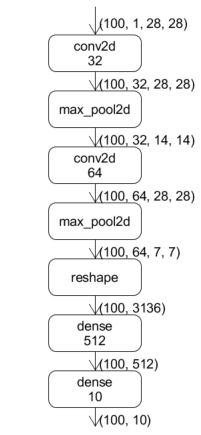

# Use OneFlow build the neural network

在之前[识别MNIST手写体数字](http://183.81.182.202:8000/quick_start/lenet_mnist.html)的例子中，我们通过 flow.layers 中的网络层和 flow.nn 中提供的算子搭建了一个简单的 lenet 网络。下面，我们将通过一个简单的神经网络，来介绍 Onflow 中网络搭建的核心—算子(op)和层(layer)。

下面的代码部分是一个主要由卷积层、池化层和全连接层组成的神经网络；图示部分展示了该网络的算子(op)和算子输出的形状。 `data` 是维度是100x1×28×28的 `Blob` ，`data` 首先作为 `conv2d` 的输入参与卷积计算，计算结果传给conv1，然后conv1作为输入传给 `max_pool2d` ，依次类推。(Note: Here isn't accurate, it is easy to understand such a description)

```python
def lenet(data, train=False):
    initializer = flow.truncated_normal(0.1)
    conv1 = flow.layers.conv2d(data, 32, 5, padding='SAME', activation=flow.nn.relu, name='conv1',
                               kernel_initializer=initializer)
    pool1 = flow.nn.max_pool2d(conv1, ksize=2, strides=2, padding='SAME', name='pool1')
    conv2 = flow.layers.conv2d(pool1, 64, 5, padding='SAME', activation=flow.nn.relu, name='conv2',
                               kernel_initializer=initializer)
    pool2 = flow.nn.max_pool2d(conv2, ksize=2, strides=2, padding='SAME', name='pool2', )
    reshape = flow.reshape(pool2, [pool2.shape[0], -1])
    hidden = flow.layers.dense(reshape, 512, activation=flow.nn.relu, kernel_initializer=initializer, name='dense1')
    if train: hidden = flow.nn.dropout(hidden, rate=0.5)
    return flow.layers.dense(hidden, 10, kernel_initializer=initializer, name='dense2')
```



上图中有两类元素，一类是方框代表的运算单元，包括 `op` 和 `layer` 两类，比如 conv2d 、 dense 、 max_pool2d 等；一类是箭头代表的数据块定义（`BlobDef`）。

## 算子(op)和层(layer)
算子(op)是比较常用的一种概念，是 OneFlow 中基本的运算单元，前面的 `reshape` 和 `nn.max_pool2d` 就是两种算子。 `layers.conv2d` 和 `layers.dense` 不是算子，它们是由算子组合成的特定的运算层(layer)。比如 `layers.conv2d` 其实是由 `conv2d` 算子和 variable 算子组成的，层的存在简化了前端的构图过程，详细参考[layers.py](api/layers.html)。

## Blob - `BlobDef` object
The statement we mention before have some part inaccurate. The network construction process and running process is separate in fact. The build process is OneFlow underlying calculation chart based on the description of the network connection relation and the process, but the real calculation happened at run time.我们这里讨论的是构图过程(compile)，不是计算过程(runtime)，`data`、`conv1` 等都是 [`BlobDef`对象](https://github.com/Oneflow-Inc/oneflow-documentation/docs/extended_topics/consistent_mirrored.md)，在 OneFlow 的语境中经常被称作 `Blob` ，它在图中处于边的位置，作为算子的输入或者输出。 `Blob` 也可以被看作是数据占位符，在构图阶段它虽然没有具体的数值，但它包括了这条边所有的信息，比如 `shape` 或者 `dtype` 。另外OneFlow中经常提到的 `lbn` ，其实就是 `Logical Blob` 的缩写，它就是用户在构建网络时头脑里的那个`Blob`。为什么一定要强调是用户头脑里的`Blob`，主要是因为，runtime阶段，这个 `Blob` 的实际数据有可能分布在不同的设备上，比如2机16卡数据并行的时候，16个卡上每张卡都只有1/16的数据，拼起来才是这个 `Blob` 对应的完整数据。

搭建网络时可以打印 `Blob` 的属性，比如要打印形状 `shape` 和数据类型 `dtype` 可以
```
print(conv1.shape, conv1.dtype)
```

### Operator overloading
BlobDef中定义了运算符重载，也就是说，BlobDef 对象之间可以进行加减乘除等操作。

Like '+' in the following code:

```
output = output + fc2_biases
```
Same as:
```
output = flow.broadcast_add(output, fc2_biases)
```

## Summary
使用 OneFlow 进行神经网络搭建，需要 OneFlow 提供的算子或层作为计算单元，BlobDef 作为算子和层的输入和输出，运算符重载帮助简化了部分语句。
