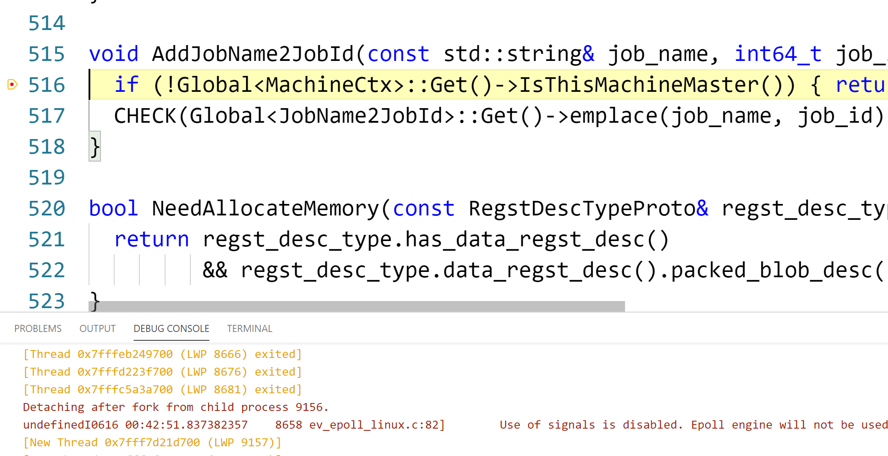

The developing environment of OneFlow is Linux. If we want to use GUI developing or configure OneFlow. We can use VS code withe a Remote - SSH connection to server.

If you are not familiar with VScode please reference to [official documentation](https://code.visualstudio.com/docs).

This article:

* How to edit the  `Debug` version of OneFlow.

* The necessary extension packages of VS code and installed guidelines.

### Edit the Debug version of OneFlow.

If use the  `Release` version of OneFlow. Because of editor optimization issue, the issue that don't correspond to the actual position and source line may occur in the process of debugging programs.

Thus, we need to edit `Debug` version of OneFlow. And need to generate json files need by clangd.

When running cmake, we need add flag of  `Debug` and `CMAKE_EXPORT_COMPILE_COMMANDS`

```shell
cmake .. \
-DCMAKE_BUILD_TYPE=Debug \
-DCMAKE_EXPORT_COMPILE_COMMANDS=1
```
Above code:

* `-DCMAKE_BUILD_TYPE=Debug`  choose the version of Debug.

* `-DCMAKE_EXPORT_COMPILE_COMMANDS`  will generate the  `compile_commands.json` files need by clangd in  `build`.

### Remote - SSH
Use the  Remote SSH of  VS Code can use SSH connects to a server.


We can operate the OneFlow on server and use Remote SSH connect  VS Code. Thus **it can let user operated just like local environment**.

After finish Remote - SSH installation, press F1 then enter `Remote-SSH: Connect to Host..` to search. After config ssh then you can connect to server.

After use Remote - SSH, in plug column, will automatically classify the local and remote. If detected the need some plug need install on remote server. It will show in grey and with a button called **Install in SSH: remote server name**. Click on that can install the corresponding plugs.


Like the figure show, we have already installed Python, clangd and NativeDebug. In order to support remote configuration.

但是远程主机并没（本地主机已经安装的）Go 和 HTML CSS Support 插件。


### clangd
After sample configuration, clangd can support convenient of code completion and symbols jump.

Before configure clangd, we need make sure:

* Already use editor generated `compile_commands.json` file.

* Already use Remote - SSH install clangd on remote console.

* We **do not** recommend installing ms-vscode.cpptools C/C++ which is recommended by VS Code. Because it could be conflicts to clangd.

#### Installing clangd
The plug on VS code use clangd services to interact and get information then display.Thus, in addition to use clangd on VS code. We also need installed clangd services program on **the console which have OneFlow source code**.

We use **download zip file and unpack** to install. More methods please reference to [ clangd offical site](https://clangd.llvm.org/installation.html).

First, download the clangd corresponding to our system version on [this site](https://github.com/clangd/clangd/releases/) and unpacked. After unpack, run the clangd testing to make sure everything can run normally.

```shell
/path/to/clangd/bin/clangd --help
```

#### Config clangd in VS code

Link the  `compile_commands.json` in building dictionary to OneFlow source code dictionary:

```shell
ln -s ./build/compile_commands.json compile_commands.json
```

Then `Ctrl+Shift+P` (macOS use `command+shift+p`), find  `Open Remote Settings`  and open  `settings.json` add the following configuration:

```json
    "clangd.path": "/path/to/bin/clangd",
    "clangd.arguments": [
        "-j",
        "12",
        "-clang-tidy"
    ]
```
More meaning or parameters of `clangd.arguments` please reference to `clangd --help`.

#### Using clangd
In View->Output dashboard in VS code, we can choose "Clang Language Server" in dropdown list. We can view the analyse output of clangd. After analyse the output,Choose the symbols of C/C++ source codes can switch to an other site.

By use `@symbols name` or `#symbols name` through `Ctrl+Shift+P` (In macOS: `command+shift+P`) can find the symbols in current file or in current project.


### native debug
Use `Ctrl + Shift + D` (In macOS: `command+shift+D`)  or double click on Run button on activity bar can switch to view of Run.


Choose `Create a launch.json file` then choose gdb template. 

Config relevant parameters:
```json
{
    "version": "0.2.0",
    "configurations": [
        {
            "name": "lenet", //defined job name
            "type": "gdb",
            "request": "launch",
            "target": "/home/yaochi/.conda/envs/ycof/bin/python3", //python path
            "arguments": "lenet_train.py", //script 
            "cwd": "/home/yaochi/of_example", //script path
            "valuesFormatting": "parseText"
        }
    ]
}
```

After set the break, press F5 to run the debug.

### Others:

* If the download speed is too slow in VS code, you can reference to [offcial document](https://code.visualstudio.com/docs/setup/network) and change `hostname` or set ssh connection.

* The [official introduction](https://clang.llvm.org/extra/clangd/Installation.html) about installing of clangd.

* The [official introduction](https://code.visualstudio.com/docs/editor/debugging) about configuration of VS code.

* The latest version of clangd may have special requirements of glibc. That may lead to have error on missing libraries.

```shell
./bin/clangd: /lib64/libc.so.6: version `GLIBC_2.18' not found (required by ./bin/clangd)
```

We can download the older version of clangd. Older version of clangd is available on [LLVM official site](https://releases.llvm.org/download.html). Download the LLVM tools package have clangd inside.
